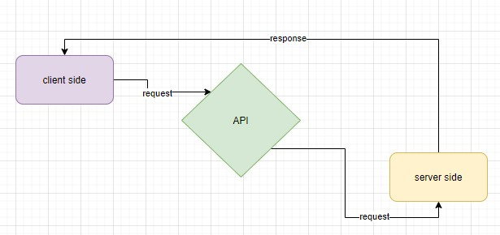

# server-deployment-practice
---
### URL's :

>Heroku applications 

|Branche|Link|
|---|---|
|dev|https://ibrahem-server-deploy-dev.herokuapp.com/|
|Main(prod)|https://ibrahem-server-deploy-prod.herokuapp.com/|

>GitHub actions:

[Action](https://github.com/ibrahemomari/server-deployment-practice/actions)

>Pull Request Url:

[Pull request](https://github.com/ibrahemomari/server-deployment-practice/pull/1)

>Digram:

